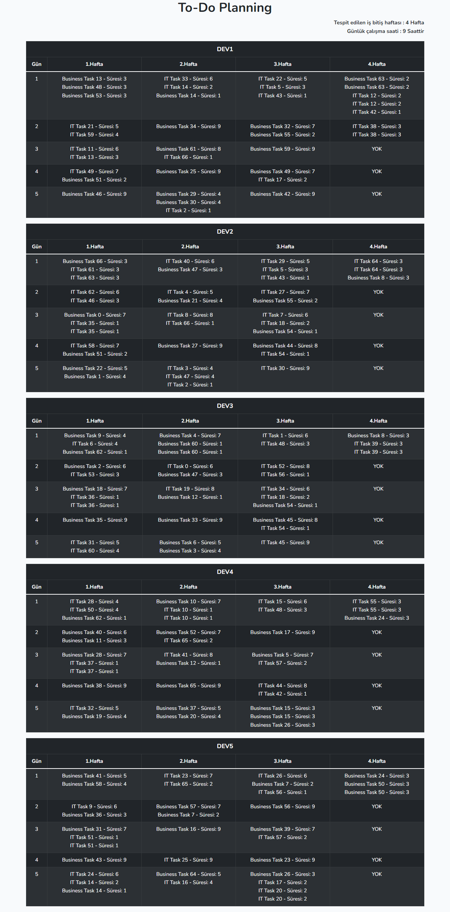

## Information
- **Laravel Framework Version:** 9.7.9
- **PHP Version:** 8.1.4
- **POSTMAN** https://documenter.getpostman.com/view/14752307/UVyvwuxr

## Installation
database/migrations/2022_04_06_140108_create_tasks_table.php
database/migrations/2022_04_07_072919_create_developers_table
çalıştırılmış olup .env nizde belirlediğiniz boş veritabanızda oluşmuş olacaktır.
```
php artisan migrate
```
Bir kere seed yaparak Developers verilerini oluşturmuş olacaktır.
database/seeders/DeveloperSeeder.php çalışacaktır
```
php artisan db:seed
```
Providers (mocky) yüklemek için:
```
php artisan mocky:loader
```
Boostrap için gereklidir.
```
npm install && npm run dev
```

## About

- Solid uygulanmıştır.
- Repository Design Pattern kullanılmıştır ve beraberinde interface -> repository bind edilmiştir.
- Standart API dönüşleri sağlanmıştır. (APIResponseTrait)
- Dil desteği vardır.
- Hata yakalama kontrolleri mevcuttur. (Handler)
- Stubs mevcuttur.

## Packages

- laravel/ui
- ui bootstrap
## Preview
- 


